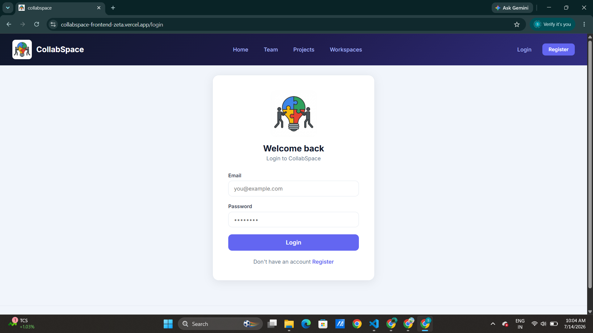
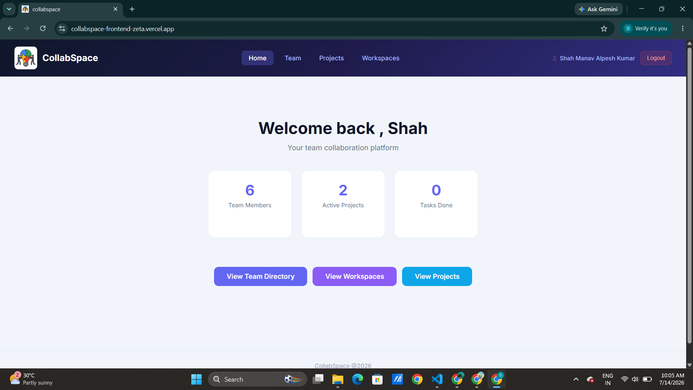
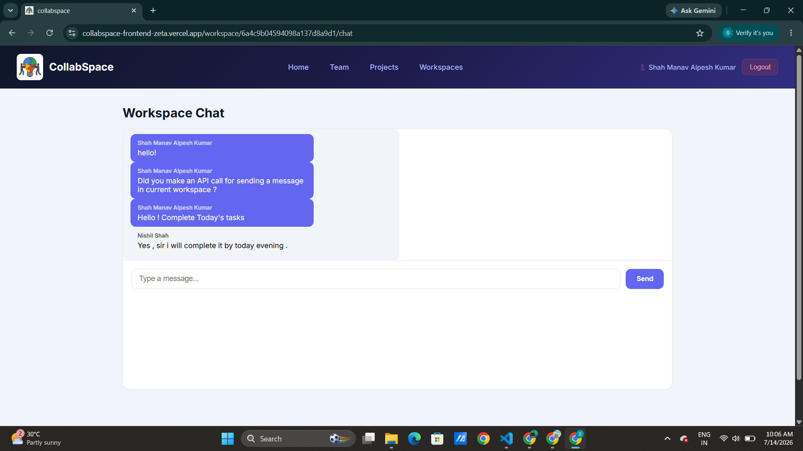

# CollabSpace — Frontend

A full-stack team collaboration platform built with the MERN stack. CollabSpace lets teams manage workspaces, projects, tasks, and real-time team chat in one place.

🔗 **Live Demo:** https://collabspace-frontend-zeta.vercel.app

🔗 **Backend Repo:** https://github.com/ShahManav2005/collabspace-api

## Features

- JWT-based authentication with protected routes
- Workspace creation and member management
- Project and task management with Kanban-style status tracking
- Real-time team directory with search and filtering
- Workspace-based team chat
- Role-based access control (admin/member/viewer)

## Tech Stack

- React 18 + Vite
- React Router for navigation
- Axios with interceptors for API calls
- Context API for global auth state

## Getting Started

\`\`\`bash
git clone https://github.com/YOUR_USERNAME/collabspace-frontend
cd collabspace-frontend
npm install
npm run dev
\`\`\`

Create a `.env` file:
\`\`\`
VITE_API_URL=http://localhost:5000/api
\`\`\`

## Screenshots

### Login Page

### Dashboard

### Workspace Chat

